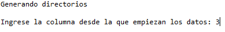

# Metadata Cleaning vía Clustering
Cleaning Library of Congress Subject Headings from the Daniel Cosío Villegas Library

## [Etiquetador.py](https://github.com/silviaegt/bdcv_metadata/blob/master/Comparador/Etiquetador.py)

La función de dicho programa es crear documentos que servirán para el
estudio de algunos comportamientos dentro de la base de datos. Para
poder tener organizados dichos documentos se genera la siguiente
estructura de directorios:

-   **Directorio principal.** Dicho directorio llevará el mismo nombre
    que el archivo de entrada donde se tenga el registro de los subs.

    -   **Network.** Dentro de este directorio se almacenarán los
        archivos "Edges.csv" y "Nodes.csv".

    -   **Subs\_reporte.** En este directorio se generan los reportes
        "cont\_por\_clas.csv", "dewey\_errors.csv", "errors\_subs.csv" y
        "subs\_reporte\_gral.csv".

    -   **Tablas**. Aquí se generarán archivos de texto plano cuyo
        nombre corresponderá a las etiquetas que fueron encontradas
        dentro de la base de datos y su contenido serán los diferentes
        temas a los que fueron asignadas.

    -   **Tablas\_count**. Aquí se generarán archivos csv cuyo nombre
        corresponderá a las etiquetas que fueron encontradas dentro de
        la base de datos y su contenido serán los diferentes temas a los
        que fueron asignadas con la frecuencia de cada uno.

### 1.1 Archivos de entrada

A continuación, se irá mencionando los archivos con los que es
alimentado el programa respetando el orden de entrada. Algunos de estos
archivos son cargados en automático, mientras que otros son solicitados
en la terminal. Todos los archivos deben encontrarse en la misma ruta
que el código.

#### 1.1.2 Dewey.csv

La finalidad de este archivo es indicar el significado de cada
clasificación Dewey y debe estar conformado con las siguientes columnas:

-   Clasificación Dewey correspondiente.

-   Significado.

Este archivo es cargado en automático dentro del programa.

#### 1.1.2 C001.csv

La finalidad de este archivo es tener la relación entre cada número de
registro y su respectivo código C001. La estructura de dicho archivo
debe estar conformado por las siguientes columnas:

-   Número de registro.

-   Valor C001.

Dicho archivo también es cargado en automático.

#### 1.1.3 Archivo con los títulos de cada libro

Este archivo será solicitado dentro de la terminal, el formato de dicho
archivo al igual que el de los demás deberá ser csv. Deberá estar
organizado de la siguiente manera:

-   Número de registro

-   Campo MARC

-   Clasificación Dewey

-   Indicadores (no se toma en cuenta por lo que puede ser una fila
    vacía)

-   Subcampo (no se toma en cuenta por lo que puede ser una fila vacía)

-   Título del libro

#### 1.1.4 Archivo con los subs

Dentro de este archivo se tendrá el contenido de cada etiqueta y a qué
libro está asignado. Su estructura es:

-   Número de registro del libro que le corresponde

-   Campo (no se toma en cuenta por lo que puede ser una fila vacía)

-   Indicador (no se toma en cuenta por lo que puede ser una fila vacía)

-   Sub

-   Contenido

Cabe mencionar que sub y contenido se pueden repetir n veces, siempre y
cuando se respete el orden sub, contenido. En caso de que no se respete
ese orden, será detectado en el programa como error.

### 1.2 Estructura de directorios generada

#### 1.2.1 Network

Dentro de este directorio encontraremos dos archivos necesarios para generar la red mediante Gephi.

##### 1.2.1.1 Edges.csv

Dentro de este archivo se tendrán las relaciones para formar la red
dentro de Gephi. El archivo arroja la siguiente información:

-   Source

-   Target

-   Weigth

-   Type

##### 1.2.1.2 Nodes.csv

En este archivo se tendrá cada uno de los elementos que conformarán la
red, y están contenidos de la siguiente manera:

-   Id

-   Nodes

-   Type

#### 1.2.2 Subs\_reporte

En este directorio se generan los reportes "cont\_por\_clas.csv", "dewey\_errors.csv", "errors\_subs.csv" y "subs\_reporte\_gral.csv". Dichos reportes serán explicados más a detalle a continuación.

##### 1.2.2.1 Cont\_por\_clas.csv

En este reporte se hace un desglose de las clasificaciones Dewey que
aparecen dentro del documento. El reporte está formado por:

-   La clasificación Dewey en centenas.

-   La clasificación Dewey en decenas.

-   La clasificación Dewey en unidades

-   La clasificación Dewey completa.

-   El total de temas que contienen dicha clasificación.

-   La cantidad de temas diferentes que contienen la clasificación.

-   Los 10 temas con mayor ocurrencia y su frecuencia de aparición.

En caso de que alguno de los registros no tuviera una clasificación
Dewey más detallada (por ejemplo "f/327.98073") también se muestra
dentro de este reporte, con la diferencia que las casillas de centenas,
decenas y unidades quedarían vacías.

##### 1.2.2.2 Dewey\_errors.csv

La finalidad de este reporte es mostrar aquellos registros en los que no
se cuente con una clasificación Dewey válida o aún no se le asigne una.
Los datos mostrados dentro de él son:

-   El número de registro que le corresponde dentro del archivo de base
    de datos ingresado al programa.

-   El valor c001 que asignado a dicho registro.

-   El error que se presenta.

-   El total de temas que presentan dicho error.

-   La cantidad de temas diferentes que presentan dicho error.

-   Los 10 temas más ocurridos con sus frecuencias.

##### 1.2.2.3 Errors\_subs.csv

Dentro de dicho reporte se hará el registro de los errores que ocurren
dentro de la base de datos, cabe mencionar que dicho reporte es el mismo
que se muestra en pantalla durante la ejecución del programa. Está
conformado de la siguiente manera:

-   Título del libro.

-   Valor c001 correspondiente a dicho libro.

-   Error que aparece.

Dichos errores pueden ser generados al momento de hacer la migración de
la base de datos a un archivo csv, por lo que es posible que dentro de
dicho reporte aparezcan errores que en la base de datos de producción no
estén.

##### 1.2.2.4 Subs\_reporte\_gral.csv

Un reporte general donde se indiquen los siguientes datos de cada
etiqueta:

-   Total de ocurrencias en diferentes registros.

-   Apariciones totales en todo el documento.

-   Total de ocurrencias diferentes en el documento (contenidos
    diferentes).

-   El promedio de ocurrencias diferentes en el documento.

-   Los 10 contenidos con mayor ocurrencia y su frecuencia de aparición.

#### 1.2.3 Tablas

Aquí se generarán archivos de texto plano cuyo nombre corresponderá a
las etiquetas que fueron encontradas dentro de la base de datos y su
contenido serán los diferentes temas a los que fueron asignadas.

#### 1.2.4 Tablas\_count

Aquí se generarán archivos csv cuyo nombre corresponderá a las etiquetas
que fueron encontradas dentro de la base de datos y su contenido serán
los diferentes temas a los que fueron asignadas con la frecuencia de
cada uno.

### 1.3 Ejecución del programa

Para que sea más claro el funcionamiento del programa utilizaremos un
caso de prueba cuyo contenido sea fácil de visualizar. La ejecución del
programa se irá mostrando paso a paso.

Como se mencionó antes, es necesario que los archivos con los que se
alimenta el programa deben estar en el mismo directorio en el que se
encuentra todo el código, en caso contrario será necesario ingresar la
ruta absoluta de los archivos.

Primero se procederá a cargar el archivo "Dewey.csv", en caso de que no
se encuentre en el mismo directorio que este código se deberá poner la
ruta correspondiente.

El archivo cargado deberá tener la estructura antes mencionada:

Posteriormente se genera un diccionario para hacer más ágil la
traducción del código Dewey y también se borra la lista en la que se
había cargado el archivo de Dewey para ahorrar el consumo de memoria
RAM.

Posteriormente se procede a cargar el archivo en el que se encuentra
almacenado el código C001 de nuestra población

La información contenida en el archivo es:

Una vez cargado el archivo, procedemos a generar un diccionario de datos
para que la búsqueda de código C001 de cada registro sea más rápida y se
borra la lista en la que se cargó originalmente el archivo.

Posteriormente en consola nos aparecerá un mensaje solicitando que le
ingresemos el nombre del archivo que contiene los títulos y el código
Dewey de cada registro. En esta ocasión, dicho archivo se llamará
títulos.csv y su contenido será el siguiente:

Posteriormente se nos solicitará que se ingrese el archivo con los subs,
en este caso el archivo se llama subs.csv y su contenido es el
siguiente:

Y se procederá a obtener un diccionario con de los títulos y la
clasificación Dewey por registro

Posteriormente se procede a crear el árbol de directorios para tener
organizada la información, nos aparecerá un mensaje que nos indica que
se van a generar los directorios.\
Posteriormente se nos solicitará ingresar la columna desde la que
empiezan los datos en el archivo de subs, como se puede ver en la image0n
anterior, los datos inician desde la columna 3 (tomar en cuenta que son
las columnas: 0,1,2,3)

Y se procederá a generar las tablas que nos permitirán hacer los
estudios. Mientras dichas tablas se van generando, en consola aparecerán
los registros en los que alguna de sus etiquetas no sea válida. Se
colocó una etiqueta inválida en el registro número 1 para demostrar su
funcionamiento.

La finalidad de cada una de las tablas es la siguiente:

-   **tables:** Diccionario en el que se agrupa todos los temas por
    etiquetas sin importar que estén repetidos o no

-   **reg2:** Diccionario en el que se agrupan todas las etiquetas por
    registro sin importar si las etiquetas se repiten o no

-   **reg3:** Diccionario en el que se agrupan todos los temas por
    clasificación Dewey sin importar si se repiten o no

-   **forNet:** Diccionario en el que se agrupa los temas y etiquetas
    por registro sin tomar en cuenta los elementos repetidos dentro del
    mismo registro

Posteriormente se procede a guardar las tablas de etiquetas obtenidas en
archivos de texto plano

Y se hace un conteo por etiqueta

Luego se procede a generar las tuplas de parámetros que serán utilizados
en los hilos de ejecución alternos del programa, esto con la finalidad
de que todo el proceso sea lineal y se haga de manera multitarea

Se inicia el primer hilo de ejecución, y se manda a segundo plano,
dentro de este hilo, se generará el reporte general. Por el tipo de
cálculos que se hacen dentro de este hilo, suele ser el más tardado y
dependiendo de la cantidad de información en la base de datos será su
duración en tiempo.

Luego se inicia el segundo hilo de ejecución, en él se genera el reporte
donde se agrupan los códigos Dewey que se encontraron dentro de la base
de datos y también se manda a segundo plano

En el hilo principal del programa se empiezan a generar los archivos
necesarios para generar una red mediante Gephi.

Para evitar que el programa termine antes de que los hilos en segundo
plano terminen su proceso se ejecuta el método join, dicho método hará
que el programa espere hasta que los hilos terminen.

Resultados obtenidos
--------------------

Dentro de la carpeta donde se encuentra todo el código, se generará una
nueva con el mismo nombre que el archivo que contenía los temas

Y como podemos ver a continuación, el árbol de directorios ya está
creado

Primero analizaremos el contenido del directorio Network, dentro de él
ya se tienen los archivos Edges y Nodes los cuales son necesarios para
crear la red

El contenido de dichos archivos se muestra en las siguientes tablas:

  id   label                      type
  ---- -------------------------- ------
  0    Idolatría                  a
  1    Siglo XVI                  y
  2    Siglo XVII                 y
  3    Siglo XVIII                y
  4    Oaxaca (México : Estado)   z
  5    India                      a
  6    Historia                   x
  7    Política y gobierno        x
  8    Religión                   x
  9    México                     a
  10   Naciones Unidas            a
  11   Consejo de Seguridad       b
  12   Relaciones exteriores      x
  13   Siglo XX                   y
  14   México                     z
  15   Industrias energéticas     a
  16   Política energética        a
  17   Recursos energéticos       a
  18   Leyes y legislación        x
  19   Política gubernamental     x

  Source   Target   Weight   Type
  -------- -------- -------- ------------
  0        1        1        undirected
  0        2        1        undirected
  0        3        1        undirected
  0        4        1        undirected
  1        2        1        undirected
  1        3        1        undirected
  1        4        1        undirected
  2        3        1        undirected
  2        4        1        undirected
  3        4        1        undirected
  5        6        1        undirected
  5        7        1        undirected
  5        8        1        undirected
  6        7        1        undirected
  6        8        1        undirected
  7        8        1        undirected
  9        10       1        undirected
  9        11       1        undirected
  9        12       1        undirected
  9        13       1        undirected
  9        14       1        undirected
  10       11       1        undirected
  10       12       1        undirected
  10       13       1        undirected
  10       14       1        undirected
  11       12       1        undirected
  11       13       1        undirected
  11       14       1        undirected
  12       13       1        undirected
  12       14       1        undirected
  13       14       1        undirected
  15       16       1        undirected
  15       17       1        undirected
  15       18       1        undirected
  15       19       1        undirected
  14       15       1        undirected
  16       17       1        undirected
  16       18       1        undirected
  16       19       1        undirected
  14       16       1        undirected
  17       18       1        undirected
  17       19       1        undirected
  14       17       1        undirected
  18       19       1        undirected
  14       18       1        undirected
  14       19       1        undirected

Posteriormente analicemos el contenido del directorio Subs\_reporte.

El contenido del archivo cont\_por\_clas para esta población de muestra
es:

El archivo de Dewey\_errors está vació debido a que dentro de la
población no se agregó ningún dato con error de código Dewey, así que
nos saltaremos a ver el contenido del archivo errors\_subs en el cual se
muestra un error por una etiqueta "ab"

Finalmente, el archivo de subs\_reporte\_gral nos muestra como es el
comportamiento de las etiquetas

Ahora procedemos a ver los archivos generados dentro del directorio
Tablas

A continuación veremos cómo dentro de cada uno de estos archivos de
texto plano se encuentran agrupados los temas que entraron dentro de la
clasificación

En el directorio Tablas\_count también se tienen agrupados los temas por
etiqueta, con la diferencia que los archivos creados son csv con la
frecuencia de aparición de cada tema.

